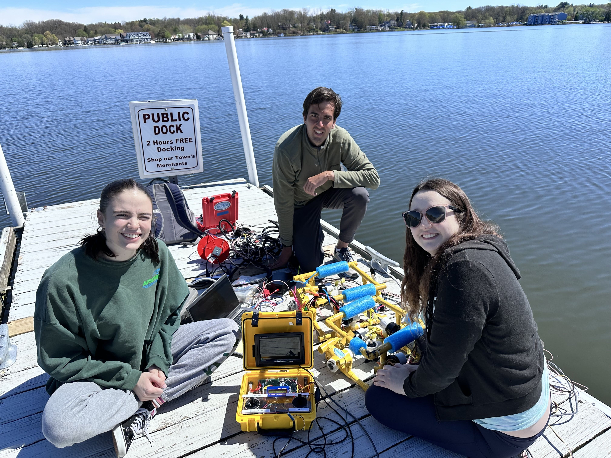

### Robotic Design
- 2 robot options: Manual and Autonomous design
- 2 different cable lengths for different depth ranges

### Sensor Design
- Dissolved oxygen sensor that can detect change in oxygen levels at different depths
- pH sensor and depth sensor
- Conductivity sensor to measure water turbidity and salinity

### Allegheny College

### Watershed Conservation and Research Center