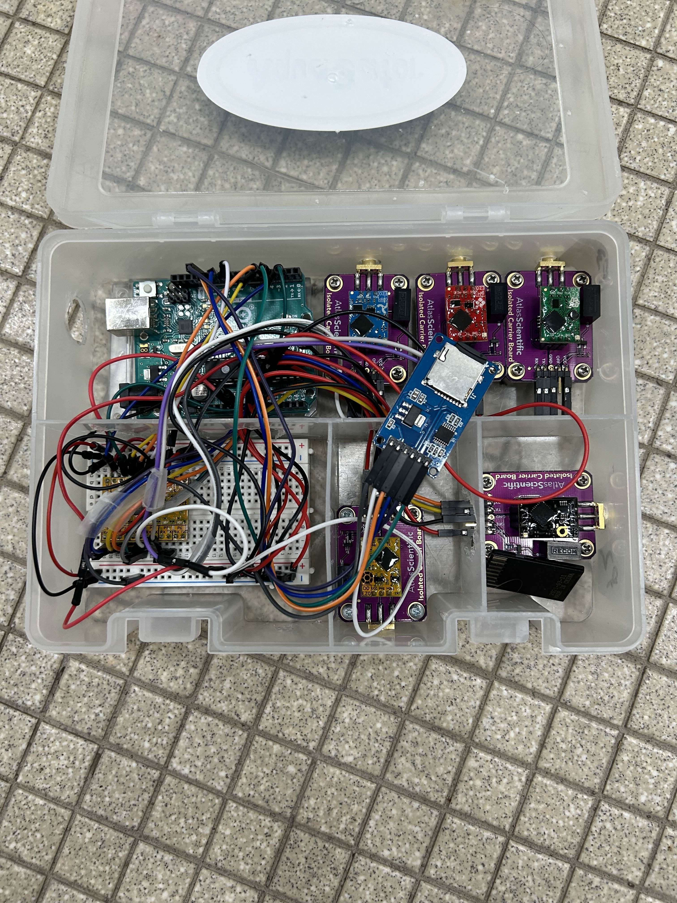

### Software Dependencies
#### Arduino Libraries
- MS5837 — Blue Robotics pressure sensor
- SabertoothSimplified — Sabertooth motor controller
- SoftwareSerial — built-in
- Wire — built-in (I2C)

#### Python (for sensor scripts)
- pyserial — pip install pyserial

### Setting up the Robot

To set up the Aquagator robot, follow these steps:

- Unpack the robot and ensure all components are present.
- Connect sensor box to color-corresponding codes on the robot.
- Connect the red box to the power supply.
- Ensure that the depth sensor is connected and turned on.
- Ensure that the robot's motors are free from the sensor connection cords.
- Connect red box to the computer using the provided USB cable.

### Operation

Aquagator operation is dependent on code usage. Specific function depends on user input for desired depth and sensor readings. The robot is designed to autonomously navigate to the desired depth and take water chemistry readings, which are then logged for later viewing. Monitor progress via the Serial Monitor on your control device.

### Robot Functions

- Remote viewing of environmental data like pH, conductivity, and dissolved oxygen.
- Camera viewing for biological and population monitoring.