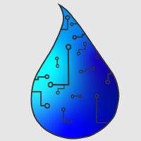

 

## About Aquagator

Aquagator is an autonomous robot designed for lake water quality monitoring. Aquagator is able to recognize water depth and take water chemistry readings like pH, conductivity, and dissolved oxygen.

### Key features

-   Autonomous depth control and navigation
-   Modular sensor suite (temperature, conductivity, depth, pH, dissolved oxygen)
-   Data logging and viewing capabilities
-   Adaptable design for multiple research applications

### Applications
-   Environmental monitoring of lakes and rivers
-   Water quality assessment for research and conservation
-   Educational tool for local scientific outreach

### Project Partners
-   French Creek Valley Conservancy
-   Watershed Conservation and Research Center

For more information or to collaborate, contact the Aquagator project team. 